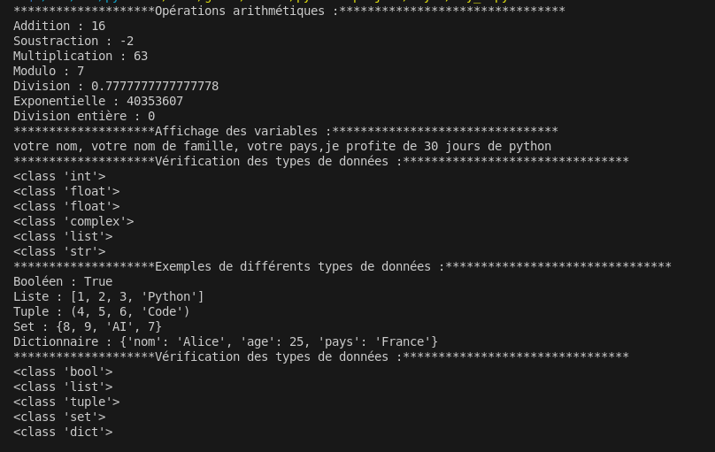

# Day 1 - Writeup

Ce document présente un compte-rendu des exercices réalisés dans le dossier **Day 1**.

## Exercices réalisés

- **Day_1** : Résolution du premier exercice, axé sur les bases de Python.

## Démarche

1. Lecture attentive de l’énoncé.
2. Analyse du problème et identification des concepts clés.
3. Rédaction et test du code dans `Day_1.py`.

## Difficultés rencontrées

- Prise en main de la syntaxe Python.
- Compréhension des instructions de base.

## Solutions apportées

- Utilisation de la documentation officielle.
- Tests progressifs pour valider chaque étape.

## Conclusion

Ces exercices ont permis de consolider les bases de Python et d’acquérir une première expérience pratique.

## Illustration

